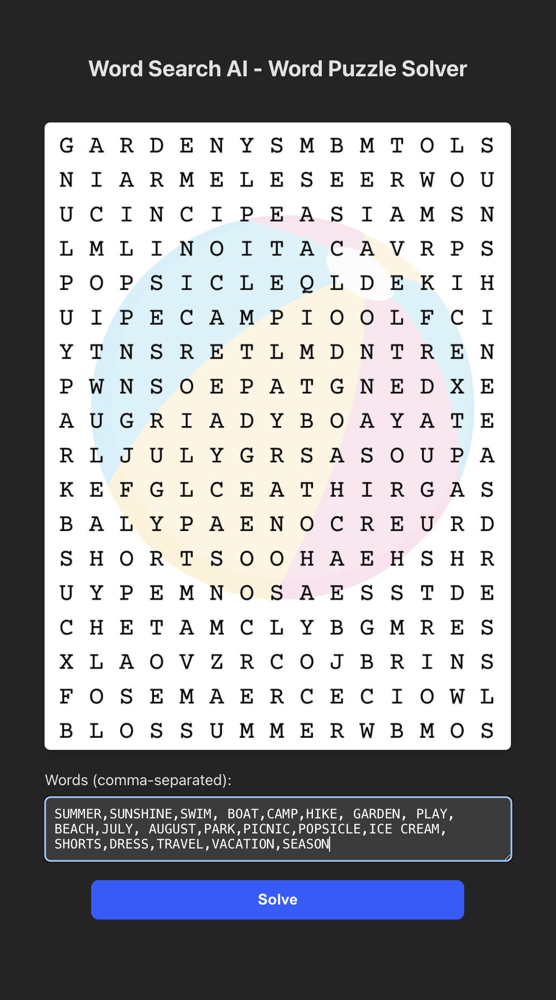
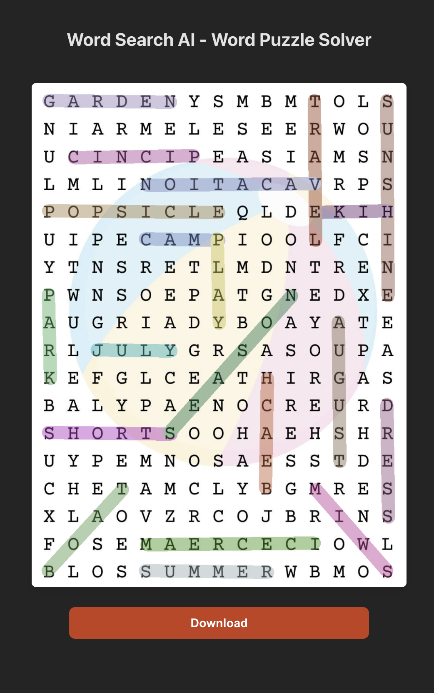
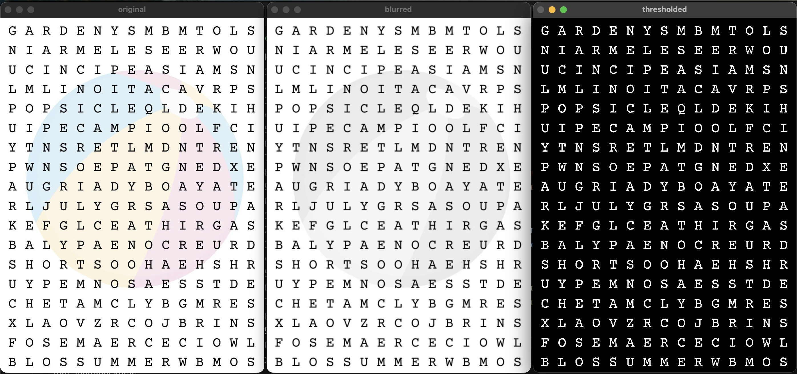
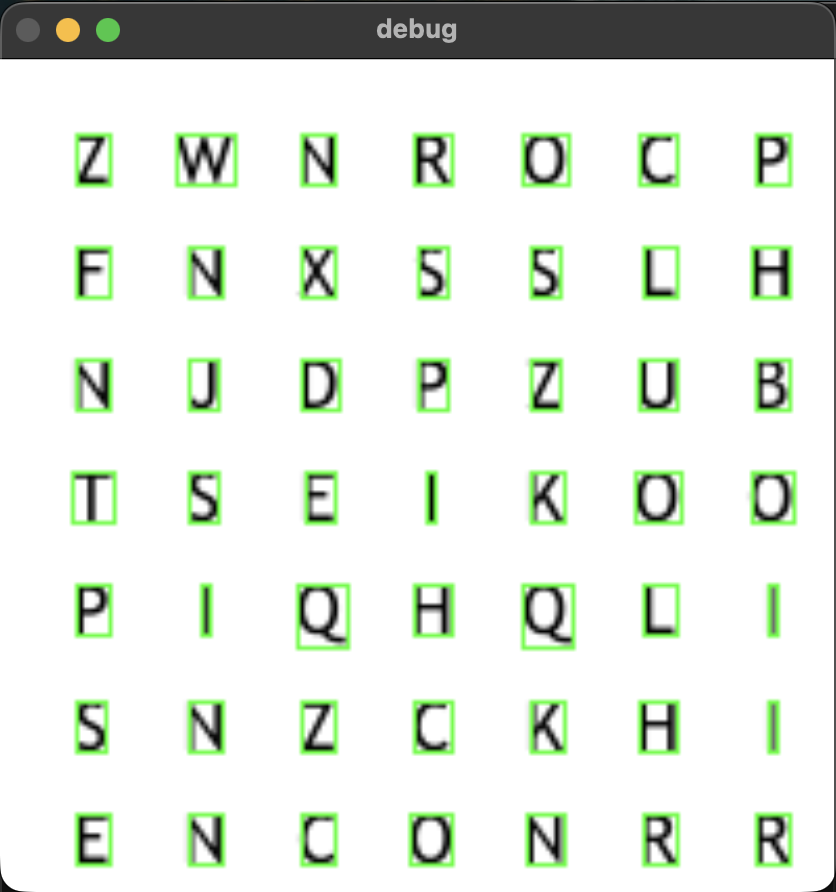

# Word Search AI

Word Search AI is an end-to-end **computer vision + machine learning system** that automatically solves word-search puzzles from images.  
The project combines **OpenCV-based image processing**, a **custom-trained TensorFlow OCR model**, and a **FastAPI backend**, exposed through a clean React frontend.

Users upload a properly aligned word-search image along with a list of words, and the system returns the same image with all detected words accurately highlighted.

---
**Frontend:** https://wordsearchai.vercel.app

> ⚠️ The backend is hosted on a free plan and may take **~45 seconds** to spin up on first request.  
> If the solver doesn’t load immediately, please refresh after a short wait.  
---

## 📸 Project Preview

### Frontend — User Experience

| Input & Preview | Solved Output |
|-----------------|---------------|
|  |  |

## 🔄 Processing Pipeline (System Map)

```
                ┌──────────────────────┐
                │   Input Image (RGB)  │
                └──────────┬───────────┘
                           ▼
              ┌──────────────────────────┐
              │   Image Preprocessing    │
              │  (Grayscale, Threshold)  │
              └────────────┬─────────────┘
                           ▼
          ┌────────────────────────────────┐
          │  Grid & Letter Segmentation    │
          │      (OpenCV Contours)         │
          └────────────────┬───────────────┘
        ┌───────────────┬──┴───────────────┐
        ▼               ▼                  ▼
┌──────────────┐ ┌──────────────┐ ┌──────────────┐
│ Bounding Box │ │ Letter Crop  │ │ Noise Reject │
│ Extraction   │ │ per Cell     │ │ / Filtering  │
└──────┬───────┘ └──────┬───────┘ └──────┬───────┘
       └────────────────┴────────────────┘
                        ▼
          ┌────────────────────────────────┐
          │ Character Normalization        │
          │  - Center on 28×28 canvas      │
          │  - Preserve padding & aspect   │
          └─────────────┬──────────────────┘
                        ▼
          ┌────────────────────────────────┐
          │ OCR Inference (TensorFlow CNN) │
          └─────────────┬──────────────────┘
                        ▼
          ┌────────────────────────────────┐
          │  Grid Reconstruction (NxN)     │
          └─────────────┬──────────────────┘
                        ▼
          ┌────────────────────────────────┐
          │ Word Search Solver             │
          │ (User-provided word list)      │
          └─────────────┬──────────────────┘
                        ▼
          ┌────────────────────────────────┐
          │ Visual Overlay + Highlighting  │
          └─────────────┬──────────────────┘
                        ▼
               ┌──────────────────────┐
               │  Solved Image Output │
               └──────────────────────┘
```

> Character normalization using padded 28×28 canvases ensures spatial consistency between training and inference.

---

### Computer Vision Pipeline Pics

- Preprocessing
  <p align="center"></p>
- Contour based grid detction
  <p align="center"></p>

---

## 🧪 OCR Model Details

- **Architecture:** Custom CNN for character recognition
- **Dataset:**
  - 17,628 synthetic images
  - Multi-font dataset (fonts sourced from Google Fonts)
- **Train / Validation Split:** 90 / 10
- **Final Training Metrics:**
  ```
  Epoch 15/15
  accuracy: 0.9882
  val_accuracy: 1.0000
  val_loss: 6.57e-04
  ```

### Real-World Performance
- Achieves **100% validation accuracy** on the curated dataset
- In practical usage:
  - Performs near-perfectly on clean, high-quality images
  - Minor degradation (~2–3 letter failures per ~220 letters) observed on pixelated or low-clarity inputs

This distinction between **model accuracy** and **end-to-end system robustness** is intentional and transparently documented.

---

## 🧠 System Architecture

### Frontend
- **React + Vite**
- Handles image upload and word list input
- Sends requests to backend and renders the solved image
- Hosted on **Vercel**

### Backend
- **FastAPI**
- **OpenCV** for image preprocessing and segmentation
- **TensorFlow** OCR model for character prediction
- Returns annotated images with highlighted solutions
- Hosted on **Render**

Both frontend and backend live in the **same repository**, organized into separate folders.  
Model training scripts, solver logic, and utilities reside at the repository root.

---

## ✨ Key Features

- 📷 Image-based word-search solving
- 🧠 Custom OCR model trained on multi-font data
- 🔍 Accurate letter segmentation using contours
- 🧩 Grid reconstruction & word-search solving
- 🖼️ Visual overlays highlighting detected words
- ⬇️ Downloadable solved image

---

## 📥 Input Format

- **Image:**  
  - Must be properly aligned and clearly visible
- **Word List:**  
  - Comma-separated
  - Spaces and symbols are ignored
  - Only alphabetical characters are considered

Example:
```
APPLE, ice cream, data-structure, AI!
```
→ Parsed as: `APPLE, ICECREAM, DATASTRUCTURE, AI`

---

## 📤 Output

- Annotated image with detected words highlighted
- Returned directly from the backend
- Available for download via the frontend UI

---

## ⚠️ Known Limitations

- Works best with:
  - Printed or digitally generated puzzles
  - Proper alignment and good image clarity
- Struggles with:
  - Skewed or rotated images
  - Perspective distortion
  - Handwritten grids
  - Heavy pixelation or blur

---

## 🛠️ Local Setup (Optional)

```bash
# Clone the repository
git clone https://github.com/renganathc/wrod-search-ai.git
cd wrod-search-ai
```

### Backend
```bash
cd backend
pip install -r requirements.txt
uvicorn main:app --reload
```

### Frontend
```bash
cd frontend
npm install
npm run dev
```

---

## 🔮 Future Improvements

- Perspective correction for skewed images
- Rotation-invariant letter detection
- Robust preprocessing for low-resolution inputs
- Batch puzzle solving
  
---

## 📄 License

This project is licensed under the **MIT License**.
